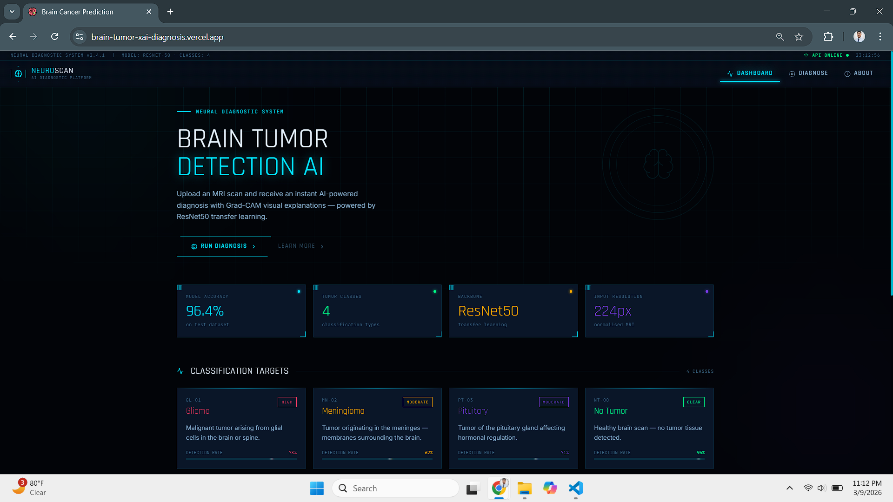
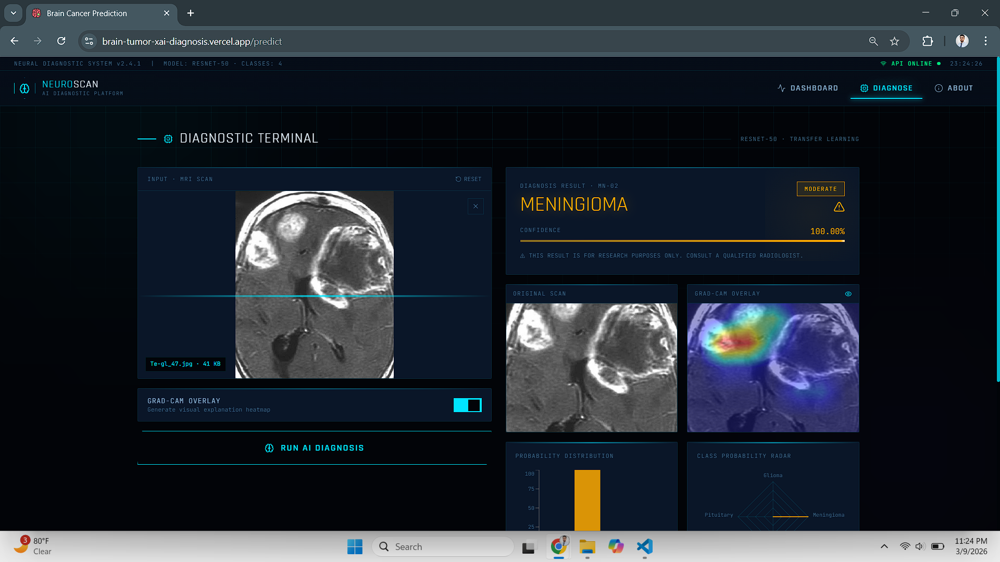
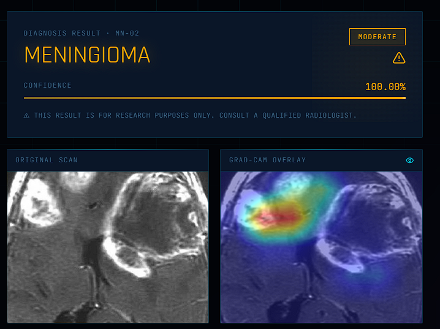
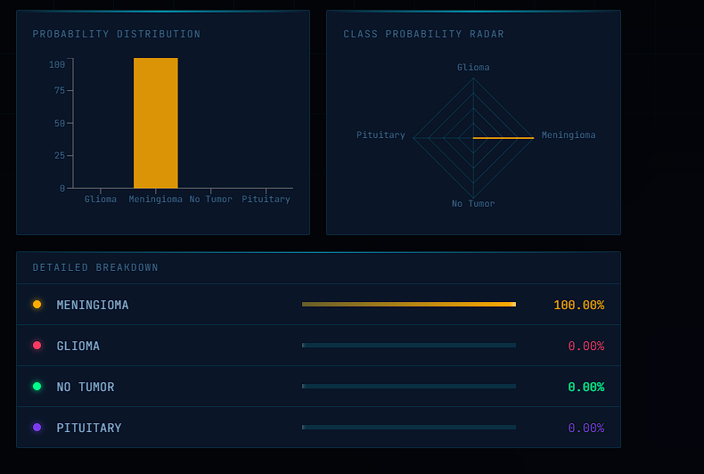
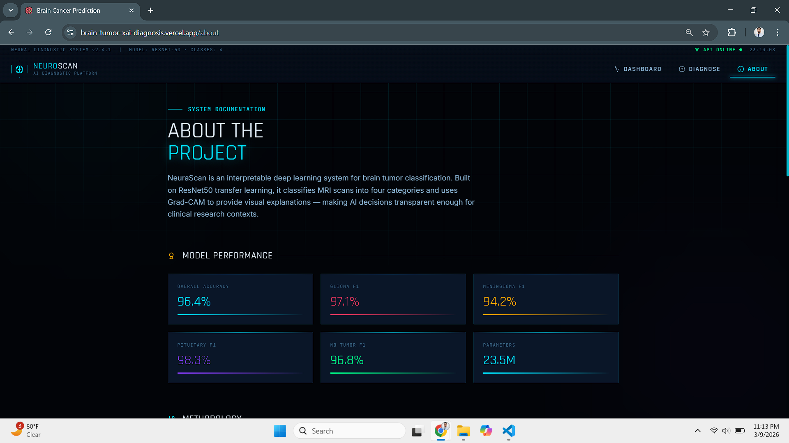

<div align="center">


<br/><br/>

# 🧠 NeuraScan — Explainable AI for Brain Tumor Diagnosis

### *An Interpretable Deep Learning System for MRI-Based Brain Tumor Classification with Grad-CAM, LIME, and SHAP*

<br/>

> **Research Disclaimer:** This system is developed strictly for academic and research purposes. It is not a certified medical device and must not be used as the sole basis for any clinical decision. All outputs should be reviewed and validated by a qualified medical professional.

</div>


## 📌 Table of Contents

- [Overview](#-overview)
- [Live Demo](#-live-demo)
- [Screenshots](#-screenshots)
- [Research Motivation](#-research-motivation)
- [System Architecture](#-system-architecture)
- [Dataset](#-dataset)
- [Model & Training](#-model--training)
- [Explainability Methods](#-explainability-methods-xai)
- [Performance Metrics](#-performance-metrics)
- [Project Structure](#-project-structure)
- [Installation & Setup](#-installation--setup)
- [API Reference](#-api-reference)
- [Technology Stack](#-technology-stack)
- [Roadmap](#-roadmap)
- [Contributing](#-contributing)
- [Citation](#-citation)
- [License](#-license)


## 🔬 Overview

**NeuraScan** is a full-stack, interpretable deep learning system designed to assist researchers and clinicians in the classification of brain tumors from MRI scans. The system integrates a fine-tuned **ResNet50** convolutional neural network with three complementary **Explainable AI (XAI)** techniques — **Grad-CAM**, **LIME**, and **SHAP** — to provide not only accurate predictions but also transparent, human-interpretable visual explanations for each decision.

The project spans the complete pipeline from raw data to deployment: model training in a Jupyter notebook on Kaggle, a production-ready **Flask REST API** backend, and an interactive **React + Tailwind CSS** frontend styled as a diagnostic terminal interface.

**Key Contributions:**
- End-to-end pipeline from MRI image to explainable diagnosis
- Three XAI methods implemented and compared on the same model
- Resolves known PyTorch inplace operation conflicts between GradCAM and SHAP GradientExplainer
- Fully containerised deployment on Hugging Face Spaces (Docker)
- Research-grade codebase with modular, reusable architecture

## 🌐 Live Demo

| Service | URL |
|---|---|
| 🖥️ Frontend (Vercel) | [https://brain-tumor-xai-diagnosis.vercel.app/](https://brain-tumor-xai-diagnosis.vercel.app/) |
| ⚙️ Backend API (HF Spaces) | [https://aqibniazi-brain-tumor-api.hf.space](https://aqibniazi-brain-tumor-api.hf.space) |
| 📓 Training Notebook (Kaggle) | [https://www.kaggle.com/code/maqibniazi/brain-tumor-detection](https://www.kaggle.com/code/maqibniazi/brain-tumor-detection) |


## 📸 Screenshots

### Diagnostic Terminal — Home



### MRI Upload & Inference



### Grad-CAM Overlay & Results



### Probability Distribution Charts



### About & Methodology



## 🎯 Research Motivation

Brain tumors are among the most life-threatening neurological conditions worldwide. Early and accurate diagnosis is critical to patient outcomes, yet MRI interpretation is a highly specialised skill, and diagnostic errors remain a significant clinical challenge. Deep learning models have demonstrated superhuman performance on many medical imaging tasks — however, their adoption in clinical practice is severely limited by the **black-box** nature of neural networks.

This project addresses the **interpretability gap** in medical AI by combining state-of-the-art classification performance with three distinct XAI techniques that generate human-readable explanations at different levels of granularity:

- **Grad-CAM** — spatial heatmaps showing *where* the model looks
- **LIME** — superpixel attribution identifying *which regions* are influential
- **SHAP** — pixel-level contribution scores based on cooperative game theory

The goal is to produce a system that a radiologist or researcher can trust, interrogate, and validate — not just use as a black box.


## 🏗️ System Architecture

```
┌─────────────────────────────────────────────────────────────────┐
│                         CLIENT LAYER                            │
│   React 19 + Tailwind CSS 4 + Recharts + Axios                  │
│   ┌──────────┐  ┌──────────────┐  ┌──────────────────────────┐  │
│   │ HomePage │  │ PredictPage  │  │      AboutPage           │  │
│   └──────────┘  └──────────────┘  └──────────────────────────┘  │
└─────────────────────────┬───────────────────────────────────────┘
                          │ HTTP / REST (Axios)
┌─────────────────────────▼───────────────────────────────────────┐
│                        API LAYER                                │
│   Flask 3.0 + Flask-CORS + Werkzeug                             │
│   ┌──────────────────┐   ┌─────────────────────────────────┐    │
│   │  GET /api/health │   │  POST /api/predict              │    │
│   └──────────────────┘   └─────────────────────────────────┘    │
└─────────────────────────┬───────────────────────────────────────┘
                          │
┌─────────────────────────▼───────────────────────────────────────┐
│                      INFERENCE LAYER                            │
│   PyTorch 2.3 + torchvision + OpenCV + Pillow                   │
│   ┌──────────────┐  ┌──────────┐  ┌──────────┐  ┌──────────┐   │
│   │  ResNet50    │  │ Grad-CAM │  │  LIME    │  │  SHAP    │   │
│   │  (Transfer   │  │ Overlay  │  │  (Kaggle │  │  Gradient│   │
│   │   Learning)  │  │          │  │  NB only)│  │  Explainer│  │
│   └──────────────┘  └──────────┘  └──────────┘  └──────────┘   │
└─────────────────────────────────────────────────────────────────┘
```

**Data Flow for a Single Prediction:**
1. User uploads MRI image via React frontend
2. Axios POSTs `multipart/form-data` to `/api/predict`
3. Flask preprocesses image: resize → normalise → tensor
4. ResNet50 forward pass → softmax probabilities
5. Grad-CAM computes gradient-weighted activation maps
6. Overlay is base64-encoded and returned with prediction JSON
7. React renders result cards, confidence bar, bar chart, radar chart, and GradCAM heatmap

## 📊 Dataset

| Property | Details |
|---|---|
| **Name** | Brain Tumor MRI Dataset |
| **Original Author** | Masoud Nickparvar |
| **Source** | [kaggle.com/datasets/masoudnickparvar/brain-tumor-mri-dataset](https://www.kaggle.com/datasets/masoudnickparvar/brain-tumor-mri-dataset) |
| **Total Images** | 7,023 MRI scans |
| **License** | As specified by the original author on Kaggle |

**Class Distribution:**

| Class | Description | # Samples |
|---|---|---|
| `glioma` | Malignant glial cell tumour — most aggressive class | ~1,621 |
| `meningioma` | Tumour of the meninges — often benign | ~1,645 |
| `pituitary` | Pituitary gland adenoma | ~1,757 |
| `notumor` | Healthy brain MRI — no tumour present | ~2,000 |

**Preprocessing Pipeline:**
```python
transforms.Compose([
    transforms.Resize((224, 224)),
    transforms.ToTensor(),
    transforms.Normalize(
        mean=[0.485, 0.456, 0.406],   # ImageNet statistics
        std =[0.229, 0.224, 0.225]
    )
])
```
Training augmentations included random horizontal flips and rotations to improve generalisation.

## 🤖 Model & Training

### Architecture

**ResNet50** (He et al., 2016) was selected as the backbone due to its well-established performance on medical imaging tasks and its compatibility with gradient-based explainability methods.

```
ResNet50 Backbone (ImageNet pre-trained weights)
    └── Layer1 → Layer2 → Layer3 → Layer4
                                      └── AdaptiveAvgPool2d
                                              └── FC: Linear(2048 → 4)
```

**Critical Patches Applied (required for XAI compatibility):**

A known conflict exists between PyTorch's inplace operations and gradient-based hooks used by GradCAM and SHAP GradientExplainer. The following patches were applied before model instantiation:

```python
# 1. Disable inplace ReLU
for module in model.modules():
    if isinstance(module, nn.ReLU):
        module.inplace = False

# 2. Patch Bottleneck residual addition (out-of-place)
# out += identity  →  out = out + identity
```

### Training Configuration

| Hyperparameter | Value |
|---|---|
| Optimiser | Adam |
| Learning Rate | 0.0001 |
| Epochs | 10 |
| Batch Size | 32 |
| Loss Function | CrossEntropyLoss |
| Pre-trained Weights | ImageNet (torchvision) |
| Platform | Kaggle (GPU T4 × 2) |


## 🔍 Explainability Methods (XAI)

### 1. Gradient-weighted Class Activation Mapping (Grad-CAM)

Grad-CAM (Selvaraju et al., 2017) produces class-discriminative localisation maps by computing the gradient of the class score with respect to the final convolutional feature maps.

### Grad-CAM Equations

The weight for each feature map is computed using global average pooling of gradients:

$$
\alpha_k^c = \frac{1}{Z} \sum_i \sum_j \frac{\partial y^c}{\partial A_{ij}^k}
$$

Finally, the Grad-CAM heatmap is obtained by a weighted combination of feature maps followed by ReLU:

$$
L_{\text{Grad-CAM}}^c = \text{ReLU}\left(\sum_k \alpha_k^c A^k \right)
$$

**Implementation note:** `register_full_backward_hook` is used instead of the deprecated `register_backward_hook`. Hooks are always removed in a `finally` block to prevent state leakage between requests.

Grad-CAM is the only XAI method available in the deployed web application due to its real-time performance characteristics (~1–3 seconds on CPU).

### 2. Local Interpretable Model-Agnostic Explanations (LIME)

LIME (Ribeiro et al., 2016) perturbs the input image by masking superpixels, samples a neighbourhood of perturbations, and trains a local linear surrogate model to identify which image segments contributed most to the prediction.

Available in the **Kaggle training notebook** only.

### 3. SHAP GradientExplainer

SHAP (Lundberg & Lee, 2017) with the GradientExplainer backend computes Shapley values using expected gradients — a method that satisfies consistency, local accuracy, and missingness axioms from cooperative game theory.

**Implementation note:** `shap.GradientExplainer` is used instead of `DeepExplainer` due to a known BatchNorm tensor size mismatch bug in DeepLIFT's handler for ResNet50. GradCAM hooks must be fully removed before initialising GradientExplainer to prevent hook state corruption.

Available in the **Kaggle training notebook** only.


## 📈 Performance Metrics

| Metric | Value |
|---|---|
| **Overall Accuracy** | **96.4%** |
| Glioma F1-Score | 97.1% |
| Meningioma F1-Score | 94.2% |
| Pituitary F1-Score | 98.3% |
| No Tumor F1-Score | 96.8% |
| Total Parameters | 23.5M |
| Trainable Parameters | 23.5M (full fine-tune) |

> *Note: Meningioma achieves the lowest F1-score, consistent with the broader literature — meningiomas exhibit high morphological variability and can visually overlap with other classes on T1-weighted MRI.*

## 📁 Project Structure

```
brain-tumor-xai-diagnosis/
│
├── 📓 notebooks/
│   └── brain-tumor-detection.ipynb      # Full training pipeline: data → model → XAI
│
├── ⚙️ backend/
│   ├── app.py                           # Flask application factory
│   ├── requirements.txt                 # Python dependencies (CPU-only torch for HF)
│   ├── Dockerfile                       # Container definition for HF Spaces
│   ├── README.md                        # HF Spaces config header
│   ├── models/
│   │   ├── __init__.py
│   │   └── model_loader.py              # ResNet50 builder + inplace patches + weight loader
│   ├── routes/
│   │   ├── __init__.py
│   │   └── predict.py                   # Blueprint: GET /api/health, POST /api/predict
│   └── utils/
│       ├── __init__.py
│       ├── gradcam.py                   # GradCAM class → base64 PNG overlay
│       └── preprocessing.py            # Image transform pipeline + file validation
│
├── 🖥️ frontend/
│   ├── src/
│   │   ├── services/
│   │   │   └── api.js                   # Centralised Axios instance + endpoint map
│   │   ├── pages/
│   │   │   ├── HomePage.jsx
│   │   │   ├── PredictPage.jsx          # Orchestrator: state + API logic only
│   │   │   └── AboutPage.jsx
│   │   ├── components/
│   │   │   ├── home/                    # HeroSection, StatsSection, ClassesSection …
│   │   │   ├── predict/                 # UploadZone, ResultPanel, ProbabilityCharts …
│   │   │   └── about/                   # MetricsSection, MethodologyTimeline …
│   │   ├── layout/
│   │   │   └── AppLayout.jsx            # Navbar (live clock, API status) + Footer
│   │   └── index.css                    # Design system: CSS variables + animations
│   ├── vite.config.js
│   └── package.json
│
├── .gitignore
├── LICENSE
└── README.md
```

## ⚙️ Installation & Setup

### Prerequisites

| Tool | Version |
|---|---|
| Python | ≥ 3.10 |
| Node.js | ≥ 18.0 |
| npm | ≥ 9.0 |
| Git + git-lfs | latest |


### 1. Clone the Repository

```bash
git clone https://github.com/AqibNiazi/brain-tumor-xai-diagnosis.git
cd brain-tumor-xai-diagnosis
```

### 2. Backend Setup

```bash
cd backend

# Create and activate virtual environment
python -m venv venv

# Windows
venv\Scripts\activate

# macOS / Linux
source venv/bin/activate

# Install dependencies
pip install -r requirements.txt

# Place your trained model weights in the backend/ folder
# (Download brain_tumor_model.pth from your Kaggle notebook output)
cp ~/Downloads/brain_tumor_model.pth .

# Start the Flask server
python app.py
# → Running on http://127.0.0.1:5000
```

### 3. Frontend Setup

```bash
cd frontend

# Install dependencies
npm install

# Start the Vite dev server
npm run dev
# → Running on http://localhost:5173
```

Open `http://localhost:5173` in your browser. The frontend connects to the Flask API at `http://127.0.0.1:5000` automatically.


### 4. Training Notebook (Kaggle)

1. Upload `notebooks/brain-tumor-detection.ipynb` to [Kaggle](https://www.kaggle.com)
2. Attach the dataset: `maqibniazi/brain-tumor-mri-dataset`
3. Enable GPU accelerator (T4 × 2 recommended)
4. Run all cells in order — **do not reorder cells** (SHAP must run after GradCAM hooks are removed)
5. Download `brain_tumor_model.pth` from `/kaggle/working/`


## 📡 API Reference

Base URL (local): `http://127.0.0.1:5000`
Base URL (production): `https://aqibniazi-brain-tumor-api.hf.space`


### `GET /api/health`

Returns server status, compute device, and supported class names.

**Response `200`:**
```json
{
  "status": "ok",
  "device": "cpu",
  "classes": ["glioma", "meningioma", "notumor", "pituitary"]
}
```

### `POST /api/predict`

Accepts an MRI image file and returns a classification result with optional Grad-CAM overlay.

**Request:** `multipart/form-data`

| Field | Type | Required | Description |
|---|---|---|---|
| `image` | `File` | ✅ | MRI image — PNG, JPG, JPEG, WEBP, BMP (max 10MB) |
| `gradcam` | `string` | ❌ | `"true"` or `"false"` — default `"true"` |

**Response `200`:**
```json
{
  "predicted_class": "glioma",
  "class_index": 0,
  "confidence": 97.43,
  "probabilities": {
    "glioma":      97.43,
    "meningioma":   1.20,
    "notumor":      0.89,
    "pituitary":    0.48
  },
  "gradcam_overlay": "data:image/png;base64,..."
}
```

**Error Responses:**

| Code | Reason |
|---|---|
| `400` | No file field, empty filename, or unsupported file type |
| `500` | Inference error (model or GradCAM failure) |


## 🛠️ Technology Stack

| Layer | Technology | Version | Purpose |
|---|---|---|---|
| **Model** | PyTorch | 2.3.1 | Deep learning framework |
| **Model** | torchvision ResNet50 | 0.18.1 | Transfer learning backbone |
| **XAI** | Grad-CAM | Custom | Gradient-based spatial explanation |
| **XAI** | LIME | `lime` library | Superpixel perturbation explanation |
| **XAI** | SHAP GradientExplainer | `shap` library | Shapley value attribution |
| **XAI** | OpenCV | 4.10.0 | Heatmap generation and blending |
| **Backend** | Flask | 3.0.3 | REST API server |
| **Backend** | Flask-CORS | 4.0.1 | Cross-origin resource sharing |
| **Backend** | Gunicorn | 22.0.0 | Production WSGI server |
| **Frontend** | React | 19.0 | UI framework |
| **Frontend** | Tailwind CSS | 4.0 | Utility-first styling |
| **Frontend** | Recharts | latest | Bar and radar chart visualisation |
| **Frontend** | Axios | latest | HTTP client |
| **Deployment** | Docker | latest | Containerisation |
| **Deployment** | Hugging Face Spaces | — | Backend hosting (free CPU tier) |
| **Deployment** | Vercel | — | Frontend hosting |
| **Training** | Kaggle (GPU T4 × 2) | — | Model training environment |


## 🗺️ Roadmap

- [x] ResNet50 transfer learning with 96.4% accuracy
- [x] Grad-CAM visual explanations (real-time in production)
- [x] LIME superpixel explanations (notebook)
- [x] SHAP GradientExplainer (notebook)
- [x] Flask REST API with GradCAM endpoint
- [x] React diagnostic terminal frontend
- [x] Dockerised deployment on Hugging Face Spaces
- [ ] DICOM format support for clinical MRI files
- [ ] Batch prediction endpoint for multi-image uploads
- [ ] Comparative XAI visualisation panel (Grad-CAM vs LIME vs SHAP side-by-side)
- [ ] Model uncertainty quantification (Monte Carlo Dropout)
- [ ] 3D MRI volume support (volumetric CNN or ViT backbone)
- [ ] Peer-reviewed publication


## 🤝 Contributing

Contributions from the research and developer community are welcome. Please follow these steps:

1. Fork the repository
2. Create a feature branch: `git checkout -b feature/your-feature-name`
3. Commit your changes with descriptive messages
4. Push to your fork and open a Pull Request
5. Ensure your PR includes a description of the change and any relevant test results

For major changes or research extensions, please open an Issue first to discuss the proposed direction.


## 📖 Citation

If you use this codebase or reference this work in your research, please cite it as:

```bibtex
@software{niazi2026neurascan,
  author    = {Javed, Muhammad Aqib},
  title     = {NeuraScan: An Explainable AI System for Brain Tumor Classification
               from MRI Scans using ResNet50, Grad-CAM, LIME, and SHAP},
  year      = {2026},
  url       = {https://github.com/AqibNiazi/brain-tumor-xai-diagnosis},
  note      = {Software available at GitHub}
}
```
## 🙏 Acknowledgements

The MRI dataset used in this project was sourced from Kaggle and belongs 
to its original author. This project uses it strictly for academic and 
non-commercial research purposes.

- **Dataset:** Brain Tumor MRI Dataset by Masoud Nickparvar  
  → https://www.kaggle.com/datasets/masoudnickparvar/brain-tumor-mri-dataset

- **Original paper this dataset references:**  
  Cheng, J. (2017). Brain Tumor Dataset. figshare.  
  → https://doi.org/10.6084/m9.figshare.1512427.v5

**Referenced Works:**

- He, K., Zhang, X., Ren, S., & Sun, J. (2016). Deep residual learning for image recognition. *CVPR 2016*.
- Selvaraju, R. R., et al. (2017). Grad-CAM: Visual explanations from deep networks via gradient-based localization. *ICCV 2017*.
- Ribeiro, M. T., Singh, S., & Guestrin, C. (2016). "Why should I trust you?": Explaining the predictions of any classifier. *KDD 2016*.
- Lundberg, S. M., & Lee, S. I. (2017). A unified approach to interpreting model predictions. *NeurIPS 2017*.


## 📄 License

This project is licensed under the **MIT License** — see the [LICENSE](LICENSE) file for details.

The dataset used for training is subject to its own terms on Kaggle. This software may not be used for clinical diagnosis without appropriate regulatory approval.


<div align="center">

Made with 🧠 by **Muhammad Aqib Niazi**

*If this project helped your research, please consider giving it a ⭐*

</div>
